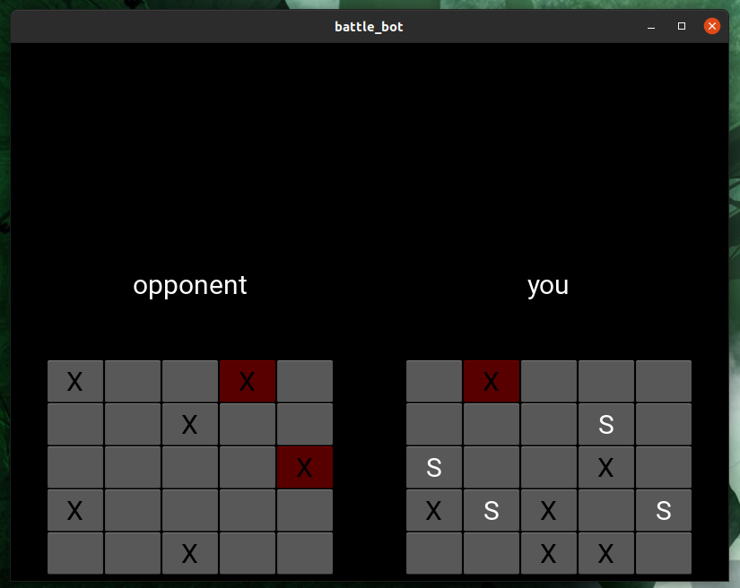
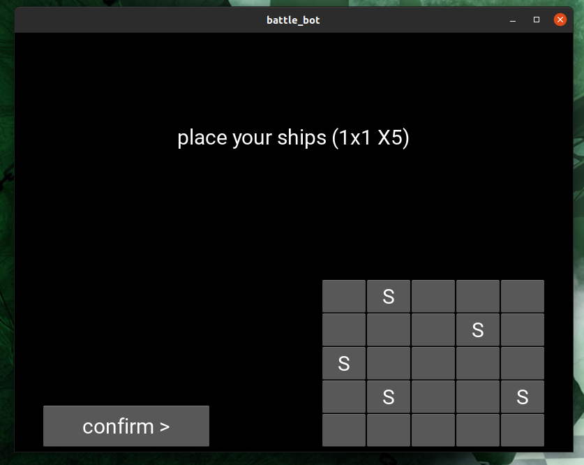

# КОРАБЛИК УДАЧІ



## 🤨 Навіщо ?:
це гра на удачу із ботом в морський бій.

## 🤓 Опис:
це гра із ботом в класичний морський бій.
тобто це навіть так... ти граєш наприклад 2 хвилини. в тебе було перед собою 120 000 000 000 паралельних і одночасно послідвних (бо йдуть один за однийй шарами) вимірів, бо твій процесор не може випередити час і того ми вперлись в його обмеження 1 ГГЦ (мінімальна чатота на якій припустимо працює він процесор), бо інакше в одного із мільʼярдів тебе фізично знак би ноутбук (а це неможливо допустити, бо це міг би бути саме ти, а є правило в корпорацій що ніхто не може розганяти процесори швидше ніж ГГЦ, того ніколи не буде ТГЦ (терагерци) або ПГЦ (петагерци) процесорів бо тоді всі інші власники повільних пк впадуть на якісь із вимірів), так от, і в кожному тактовому вимірі кораблі в бота стояли по різному. в тебе були однакові шанси на КОЖНОМУ із них... але якщи ти програв, то тобі не пощастило, і ти не попав в ЖОДНОМУ із цих 120 000 000 000 шарів реальності. це все були 120 000 000 000 версій тебе. 120 000 000 000 шансів. І жоден із ЦИХ ПАРАЛЕЛЬНИХ ТЕБЕ не виграв. ти теперішній - всього лиш один із цих паралельних 120 000 000 000 неудачників. і це лише за 2 хвилини. ну як тобі кораблик ? зіграємо іще, може на цей раз ХОЧ ОДИН із цих тисяч тебе в паралельності зможе попасти по правильнній кнопкі в правильний час....

## ☠️ Використані технології:
- все написано на PYTHON
- GUI на KIVY

## 🌱 Структура проекта:
- `screenshots/` — непотрібна для роботи програми, зберігаються лише скраншоти роботи програми
- `main.py` — головний файл, його можна запускати

## 😎 Як це запустити ?:
1. встановлюємо необхідні пакети
```bash
sudo apt update
sudo apt install python3
sudo apt install python3-pip python3-dev libsdl2-dev libsdl2-image-dev libsdl2-mixer-dev libsdl2-ttf-dev libportmidi-dev libswscale-dev libavformat-dev libavcodec-dev zlib1g-dev libgstreamer1.0-0 gstreamer1.0-plugins-base gstreamer1.0-plugins-good
pip install "kivy[base]"
```
2. запускаємо програму
```bash
python3 main.py
```
3. зʼявиться віконечко розстановки кораблів і кнопка почати гру


## ❓ Швидкі питання і відповіді
1. "це що, казіно ? я лудоман якщо в це зіграю ?" - "да..."
